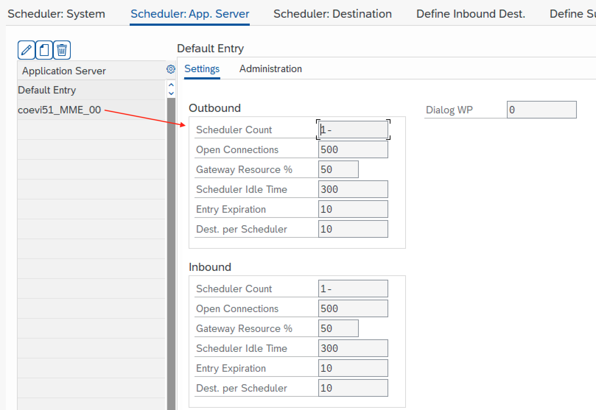
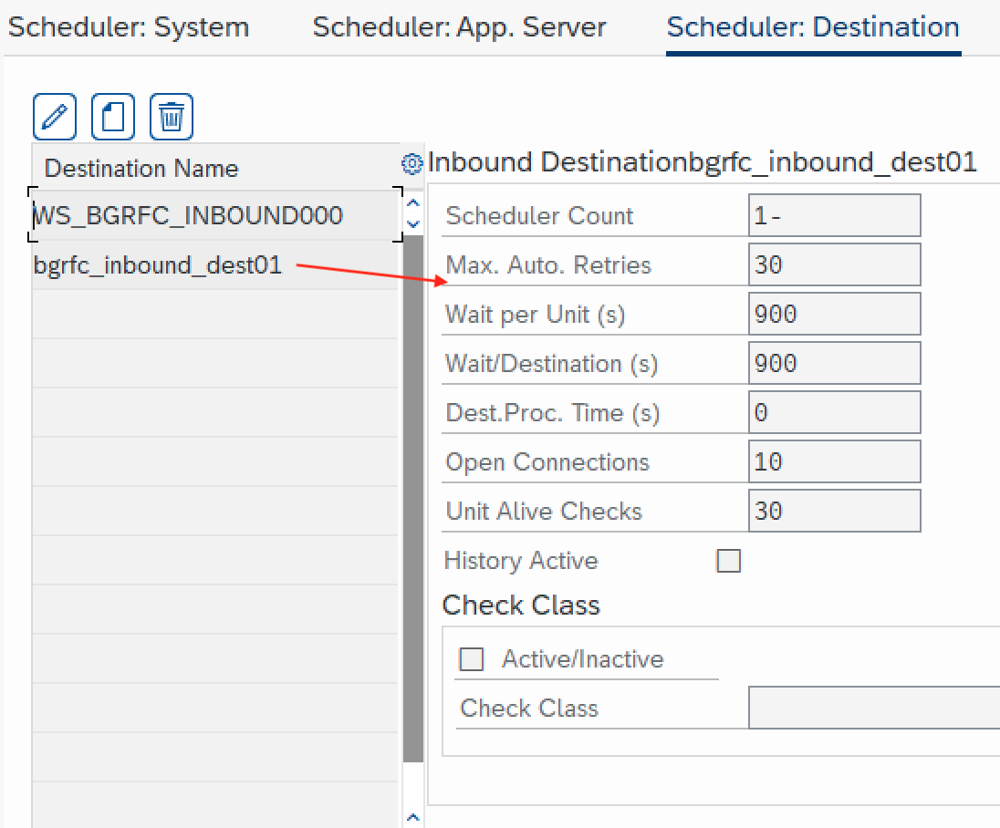

# Background RFC Server

## Configuration

### ALX

Configure RFC destination using SM59 transaction:

- TCP/IP Connection `NWRFC_SERVER_OS`
- Special Options > Select Protocol: basXML serializer


### MME

Configure bgRFC queues using transaction `SBGRFCCONF`

Scheduler app server and destination





Configure inbound destination prefixes for bgRFC queues' names. Other queue names are processed as standard RFC queues.


### Python

- `sapnwrfc.ini`

```ini
DEST=ALX
MSHOST=ldcialx
MSSERV=9914
GROUP=PUBLIC
CLIENT=000
LANG=EN
USER=BOSKOVIC
PASSWD=Kol!ko11

DEST=ALX_GATEWAY
GWSERV=sapgw18
GWHOST=ldai5alx.wdf.sap.corp
PROGRAM_ID=RFCSERVER
REG_COUNT=1

DEST=BCO
MSHOST=ldcsbco
MSSERV=5357
GROUP=PUBLIC
CLIENT=000
LANG=EN
USER=NWRFCTEST
PASSWD=Welcome1
```

## Test

### Python

```python
python examples/server/bgrfc_server.py ALX | MME | QM7
```

### ALX

1. Start Python server

2. Run test report `z_nwrfc_server_bgrfc` with parameters:

   - QNAME_O: BASIS_BGRFC_OUTIN
   - QNAME_IN: NCO_CONN_JUNIT_QUEUE_BC
   - RFCDEST: NWRFC_SERVER_OS
   - LOCK_OUT: X
   - LOCK_IN: X

3. Run transaction `SBGRFCMON`, select outbound queues for destination NWRFC_SERVER_OS

4. Delete queue lock to submit the queue to Python


### MME

1. Start Python server

2. Run test report `z_nwrfc_server_bgrfc` with parameters:

   - QNAME_O: BASIS_BGRFC_OUTIN
   - QNAME_IN: RFCSDK_QUEUE_IN
   - RFCDEST: NWRFC_SERVER_OS
   - LOCK_OUT: X
   - LOCK_IN: X

3. Run transaction `SBGRFCMON` and find the locked queue `RFCSDK_QUEUE_IN`

4. Delete the lock, so that queue gets executed.

Run SE16 and check TCPIC table

```ini
DEST=gateway
GWSERV=sapgw00
GWHOST=coevi51
PROGRAM_ID=SERVER1
REG_COUNT=1

DEST=MME
USER=demo
PASSWD=welcome
ASHOST=coevi51.wdf.sap.corp
#ASHOST=10.68.110.51
SYSNR=00
CLIENT=620
LANG=EN
#TRACE=3
```
